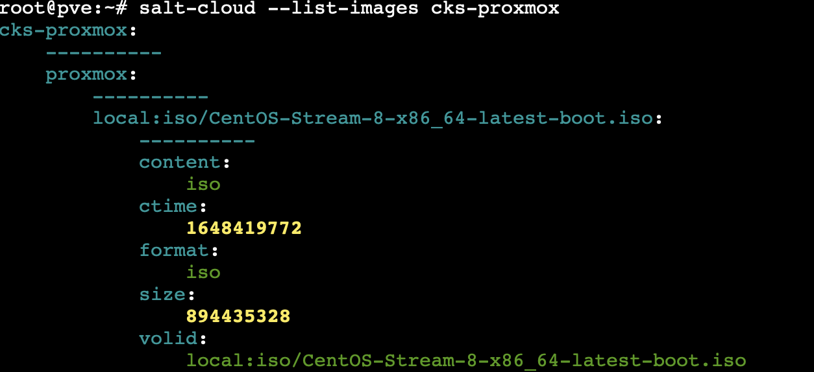

####################
K8s Production-Grade 
####################

Creating a Kubernetes cluster to test building clusters and hosting cloud
native applications in on prem environments using mostly open source.

**Contents**

=========
Objective
=========

Build a K8s cluster using technologies available at work as a proof of concept
and reusable template to build from.

.. note::

   The idea is to **keep the cluster as simple as possible while meeting
   production-grade requirements** and scale to run sizable, but not extreme,
   machine learning and big data compute applications.

Production means:

* The installation is secure
* The deployment is managed with a repeatable and recorded process
* Performance is predictable and consistent
* Updates and configuration changes can be safely applied
* Logging and monitoring is in place to detect and diagnose failures and
  resource shortages
* Service is “highly available enough” considering available resources,
  including constraints on money, physical space, power, etc...
* A recovery process is available, documented, and tested for use in the event
  of failures

*What do these considerations mean then for Kubernetes components?*

**Kubernetes components from a high availability perspective**

+--------------------------+------------------------------+------------------------------------------+-------------+
| Component                | Role                         | Effect of Loss                           | Recommended |
|                          | Role                         |                                          | Instances   |
+==========================+==============================+==========================================+=============+
| etcd                     | Maintains state of all       | Loss of storage is catastrophic. Loss of | odd #, 3+   |
|                          | Kubernetes objects           | majority means Kubernetes loses control  |             |
|                          |                              | plane, API Server depends on etcd,       |             |
|                          |                              | read-only API calls not requiring a      |             |
|                          |                              | quorum may work, and existing workloads  |             |
|                          |                              | may continue to run.                     |             |
+--------------------------+------------------------------+------------------------------------------+-------------+
| API Server               | provides API used internally | Unable to stop, start, update new pods,  | 2+          |
|                          | and externally               | services, replication controller.        |             |
|                          |                              | Scheduler and Controller Manager depend  |             |
|                          |                              | on API Server. Workloads continue if     |             |   
|                          |                              | they are not dependent on API calls      |             |
|                          |                              | (ie operators, custom controllers, ERDs) |             |
+--------------------------+------------------------------+------------------------------------------+-------------+
| kube-scheduler           | Places pods on nodes         | No pod placements, priority and          | 2+          |
|                          |                              | preemption                               |             |
+--------------------------+------------------------------+------------------------------------------+-------------+
| kube-controller-manager  | Runs many controllers        | Core control loops that regulate state   | 2+          |
|                          |                              | cease, in-tree cloud provider            |             |
|                          |                              | integration breaks.                      |             |
+--------------------------+------------------------------+------------------------------------------+-------------+
| cloud-controller-manager | Integration for out-of-tree  | Cloud provider integration breaks        | 1           |
| (CCM)                    | cloud providers              |                                          |             |
+--------------------------+------------------------------+------------------------------------------+-------------+
| Add-ons (e.g., DNS)      | Varies                       | Varies                                   | Depends on  |
|                          |                              |                                          | add-on, 2+  |
|                          |                              |                                          | for DNS     |
+--------------------------+------------------------------+------------------------------------------+-------------+

-----------------
Node Architecture
-----------------

Considerations

* **etcd** - 3 or 5 nodes 8GB RAM and a 20GB. A five-node etcd cluster is a
  best practice if you can afford it. Why? Because you could engage in
  maintenance on one and still tolerate a failure.
* **3+ hosts** - Run etcd, API server, scheduler, controller manager in a VM on
  three hosts. Application workload runs in a VM on each host.

**Host Nodes Layout and Resources**

+---------------+---------------+-----------------+-----+--------+--------+
| VM Name       | Role          | IP Address      | CPU | RAM    | DISK   |
+---------------+---------------+-----------------+-----+--------+--------+
| saw-k8s-ha-01 | Load Balancer | 192.168.100.150 | 2   | 4 GB   | 20 GB  |
+---------------+---------------+-----------------+-----+--------+--------+
| saw-k8s-m-01  | Master        | 192.168.100.151 | 2   | 8 GB   | 20  GB |
+---------------+---------------+-----------------+-----+--------+--------+
| saw-k8s-m-02  | Master        | 192.168.100.152 | 2   | 8 GB   | 20  GB |
+---------------+---------------+-----------------+-----+--------+--------+
| saw-k8s-m-03  | Master        | 192.168.100.153 | 2   | 8 GB   | 20  GB |
+---------------+---------------+-----------------+-----+--------+--------+
| saw-k8s-w-01  | Worker        | 192.168.100.154 | 2   | 16 GB  | 20  GB |
+---------------+---------------+-----------------+-----+--------+--------+
| saw-k8s-w-02  | Worker        | 192.168.100.155 | 2   | 16 GB  | 20  GB |
+---------------+---------------+-----------------+-----+--------+--------+
| saw-k8s-w-03  | Worker        | 192.168.100.156 | 2   | 16 GB  | 20  GB |
+---------------+---------------+-----------------+-----+--------+--------+
| saw-k8s-w-04  | Worker        | 192.168.100.157 | 2   | 16 GB  | 20  GB |
+---------------+---------------+-----------------+-----+--------+--------+
|                                                 | 16  | 92 GB  | 160 GB |
+-------------------------------------------------+-----+--------+--------+

This node layout should allow for a good simulation of what would be done using
hardware/VMs available in an on premise data center. In practice, The number of
masters would optimally be 5, and the size and number of workers would
hopefully be higher, but this is good size for testing purposes.

===================
Target Technologies
===================

* **VM hypervisor** - `Proxmox VE`_ for VM management
* **Configuration management** - Salt_ for IaaC to setup and maintain Kubernetes nodes programmatically
* **VM OS** - CentOS_ for node operating systems to simulate using RHEL 8
* **K8s ingress controller** - HAProxy_ for high availability load balancing
* **K8s cluster creation**- kubeadm_ for bootstrapping K8s nodes 

.. _`Proxmox VE`: https://www.proxmox.com/en/ 
.. _Salt: https://saltproject.io
.. _CentOS: https://www.centos.org/download/
.. _HAProxy: http://www.haproxy.org
.. _kubeadm: https://kubernetes.io/docs/setup/production-environment/tools/kubeadm/create-cluster-kubeadm/

**Assets list**

1. CentOS ISO: CentOS-Stream-8-x86_64-latest-boot.iso
2. HAProxy package: 

==========
Salt Setup
==========

To setup Salt in the Proxmox host take the following steps logged in as root or
using sudo.

1. Install Salt using `Debian install instructions`_ in documentation--should
   install salt-master and salt-minion
2. ``apt install python-pip3`` using apt because ``ipy`` needs to be added to
   Proxmox Debian Python 3
3. ``pip3 install ipy`` to install IPy into the Debian host Python 3 environment
   used by Salt
4. Install ``salt-cloud`` using Debian apt package manager 
5. Setup a Proxmox cloud provider config in ``/etc/salt/cloud.providers.d/proxmox.conf``
   similar to the following

.. _`Debian install instructions`: https://docs.saltproject.io/salt/user-guide/en/latest/topics/installation.html

.. code:: yaml

   my-proxmox-config:
     # Proxmox account information
     user: myuser@pam or myuser@pve
     password: mypassword
     url: hypervisor.domain.tld/IP
     port: 8006
     driver: proxmox
     verify_ssl: True

Test that the config is correctly setup by running following as a test.

.. code:: bash

   salt-cloud --list-locations <provider_name>  # my-proxmox-config in the previous example
   salt-cloud --list-images <provider_name>
   salt-cloud --list-sizes <provider_name>

Output should look something like this.

References:

* `How to make Kubernetes production grade anywhere <https://kubernetes.io/blog/2018/08/03/out-of-the-clouds-onto-the-ground-how-to-make-kubernetes-production-grade-anywhere/>`_

